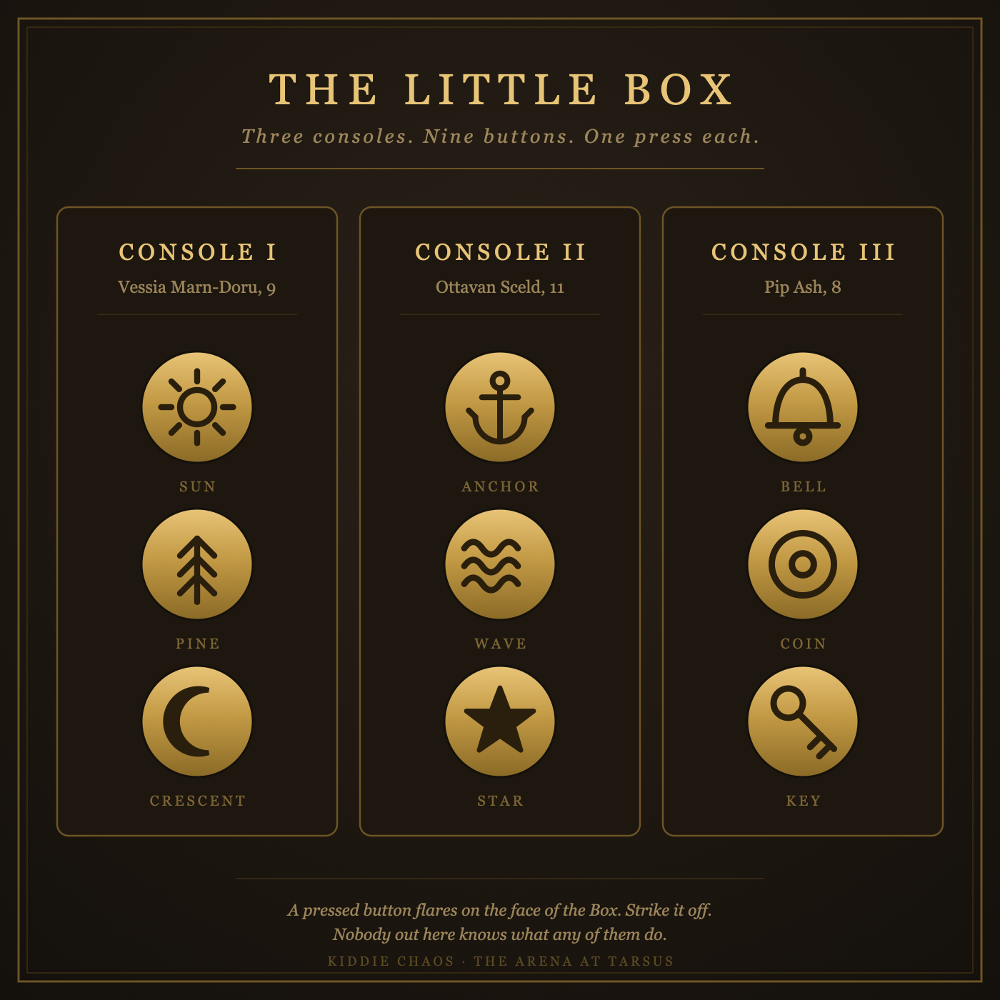

# Kiddie Chaos

- **Hook:** Once a year, on the turn of the season, three children win a public lottery for the right to sit in the Little Box above the sand and press the buttons that bend the Arena. The lottery is sworn to be fair. Two of the three winners are always the children of Senate families. Everyone knows. Everyone cheers anyway.
- **Party:** 3-6 PCs, level 5. The fight is ordinary. The Arena is not.
- **Sibling idea:** [[polymorphic_chaos|Polymorphic Chaos]]. That bout puts the wild magic in pillars the PCs can smash. This one puts it in the hands of an eight-year-old.

## Why It Works Here
The [[the_arena|Arena]] already casts on everyone inside it: `reduce` to make the sand feel wider, `slow` to stretch a death out for the back rows. So the Little Box is not new machinery. It is three copies of the magisters' own console, wired into the same lattice and fitted with brass buttons big enough for small hands. The Arena has always been able to do this. The only thing the lottery adds is who decides.

## Arena Layout
- Full floor, 200 feet, dressed this year as a broken market square: stalls, a dry fountain, and a 15-foot bell tower at center.
- Standard 20-foot walls. Under Reverse Gravity those walls become a ceiling, and the tower becomes a spike pointed at the sky.
- The **Little Box** hangs off the north wall at 30 feet: gilded, cushioned, warded, and out of a fighter's reach. Attacks and spells aimed at the Box fail against the same ward-stone that keeps the crowd safe.
- Three consoles inside, identical, drawn by lot. Each has **three brass buttons** stamped with a pictogram. The magisters re-cut the stamps and rewire the mapping every year, so last year's answers are worth nothing.
- The **conduit** runs down the inside of the north wall from the Box to a junction plate at floor level, behind the north gate. It is not warded. Nobody looks at it. See [[#Killing the Box]].

## The Three Winners
- **Vessia Marn-Doru**, 9. Grain-contract money. Presses with the flat of her whole hand and watches the crowd, not the sand.
- **Ottavan Sceld**, 11. Admiral's son. Has done this twice before. Waits. Times his press for the moment a fighter is winning.
- **Pip Ash**, 8. Gutter-sweep's daughter, and the only winner who actually won. She is the reason the lottery survives scrutiny: one commons child a year is what lets the magisters call it fair. Pip does not know this. She presses when someone she likes is about to die, which is the worst possible timing and always the best television.

## Before the Bout
Run this as a scene, 10-15 minutes, before initiative. The three winners are brought down to the staging gate for the portraits and the oath — an old tradition, and a chance for the sponsors to see which fighter each child likes. The PCs are held there with them.

- **Vessia** arrives with a household guard and a woman who tells her which fighter to be photographed beside. She will ask a PC, flatly, how many people they have killed, then ask whether it was on purpose. She is not being cruel. She wants to know.
- **Ottavan** already knows the staging gate. He will greet a PC by name and reputation, ask a genuinely sharp tactical question about their last bout, and then say something that makes it clear he has money on someone else. He is not a monster. He is eleven and being trained into one.
- **Pip** is terrified, then not. She has never been indoors anywhere this big. She will attach herself to whichever PC speaks to her like a person and ask what the sand feels like, whether it hurts, and whether they are scared. If a PC lies to her about the last one, she knows.

**Outcome:** each PC may make one social approach. A success — Persuasion, Performance, an honest answer, a gift, a trick — means that child is **theirs** for the bout: they will press when that PC is in trouble. That is not the same as pressing to help. A child cannot aim.

## The Console
Nine effects. Each button is used **once**, then it is dead for the bout. A child may press only at the top of a round, and only **one button is pressed per round** — the magisters space them so the bets can settle.

Effects hit **everyone on the sand** or **random targets**. A child cannot choose a target, cannot aim, and cannot un-press.

**Player-facing handout:** [`assets/kiddie_chaos_console_card.png`](assets/kiddie_chaos_console_card.png) (source `.svg` beside it). Nine symbols, grouped by child, no effects named. Print it, put it on the table, and strike each symbol off as it burns. When a button is pressed, its stamp **flares on the outer face of the Box** so ten thousand people can see which one went — that is how the card gets filled in, and it is the only information the sand ever gets.

### GM-only: symbol to effect
Keep this side of the screen. Reshuffle it freely if the party ever plays this bout twice.

| Console | Symbol | Effect | Resolution |
|---|---|---|---|
| I — Vessia | **Sun** | **Everyone Big** | All creatures are *enlarged* for 1 minute. The stalls become knee-high. Anyone inside a stall or the tower takes 1d6 and is shoved prone. |
| I — Vessia | **Pine** | **The Hush** | All sound in the Arena stops for 1 minute — *silence*, wall to wall. No spell with a verbal component can be cast. Nobody can call a warning, a name, or a plan. Every creature on the sand is deafened. Thunder damage does nothing. Ten thousand people stamp their feet and none of it arrives. |
| I — Vessia | **Crescent** | **Reverse Gravity** | Everything on the sand falls up for 1 minute. DC 14 Dex save to catch a fixture and hang on. Falling creatures strike the ward-field at 20 feet for 2d6 and hang there. Ends without warning. |
| II — Ottavan | **Anchor** | **Slow** | Everyone on the sand is *slowed* (DC 15 Wis negates) for 3 rounds. The crowd counts each action aloud. |
| II — Ottavan | **Wave** | **Downpour** | Heavy rain and mud for the rest of the bout: ranged attacks at disadvantage, open ground is difficult terrain, and lightning strikes one random combatant at the end of each round for 3d10 (DC 15 Dex for half). |
| II — Ottavan | **Star** | **Random Polymorph** | Roll a d4 of random combatants; each becomes a CR 1-2 beast (see [[polymorphic_chaos|the Beasts table]]) for 1 minute. DC 15 Wis negates. |
| III — Pip | **Bell** | **Mirror Skins** | For 1 minute every creature on the sand looks identical — same grey fighter, same face. Attacks against a creature you did not touch last round are at disadvantage. The announcer keeps calling the wrong name. |
| III — Pip | **Coin** | **Everyone Small** | All creatures are *reduced* for 1 minute. The dry fountain is now a canyon. Weapon damage drops a die; the sand feels 400 feet wide. |
| III — Pip | **Key** | **The Shuffle** | Every creature on the sand teleports to a random other creature's space. Roll it openly. No save. |

**Bell into Key.** If Mirror Skins is running when the Shuffle lands — or you can press for it — nobody on the sand knows who anyone is. Identical faces, scrambled positions. Let the table sit in that for a round before anyone swings. It is the best moment the bout has.

## The Empty Box
The lattice is charged for nine. It is not built to hold what is left over when the ninth is gone.

**Trigger:** at the end of the round in which the **last remaining button** is pressed. Not the ninth press — the last one *available*, so killing a console brings the finale early.

- Every creature on the sand: **DC 15 Dexterity save**. Fail **8d6** force damage, half on a success.
- Nothing else. No condition, no rider, no lingering terrain. Just the bill.
- **If a console was smashed** rather than unwired, the surge already bled off part of the charge: **6d6** instead.
- A **Mote of Refusal** stops it dead. This is the moment the mote is for, and it is the reason not to spend it on something merely frightening.

The crowd knows this is coming. They start counting down the buttons around the fourth one, out loud, and by the last symbol ten thousand people are chanting the number. The fighters can hear them. That is the point: the finale is the only thing in this bout that everybody sees arriving and nobody can move out of the way of.

**Let the party learn it in advance.** Sold as intel, or told by a veteran in the pens. A finale nobody saw coming is a gotcha; a finale everyone watches approach for six rounds while deciding whether to spend their bead is the whole game in miniature.

## Motes of Refusal
Every combatant is handed a chalk-white bead at the gate. The betting houses insisted; a bout that is pure noise cannot be wagered on.

- **One per PC, one use, no recharge.** Reaction, spent when a spell or a Console effect would affect you.
- You are simply not affected. Everyone else still is.
- It refuses the magic, not the world. Refuse Reverse Gravity and you stay on the sand while the fight goes up — and the fight comes back down on top of you.
- Refuse an effect that is already running and you shed it; you cannot pre-spend it.
- **The crowd counts your mote.** End the bout with it unspent and take **-1 [[crowds_favor|Favor]]**. The mob did not pay to watch a fighter save his bead.

## Killing the Box
A PC who spends a turn looking at the north wall instead of the Box can see it: a hairline seam of glyph-light running down the stone from the Box to a brass junction plate behind the north gate, ankle-high, unremarkable.

- **Spot it:** DC 14 Perception while within 30 feet of the north wall, or DC 12 Arcana / Investigation from anywhere if the PC watches an effect resolve and traces where the light came from. Any PC with an arcane background gets advantage.
- **Reach it:** the junction is at floor level behind the north gate — no climb, but it is the most exposed square on the sand, and the Wall-Huggers know what it is.
- **Break it:** the plate is AC 17, 25 HP, resistant to nonmagical damage. Or unwire it cleanly: DC 17 Arcana or Thieves' Tools, one action, failure by 5+ means a shock (2d8 lightning) and the tools are welded to the plate.
- **Smashing it surges.** Break the plate and every button on that console fires at once as the charge dumps — resolve all of its **unused** effects in one round, in any order, then that console is dead for the bout. Unwiring it cleanly kills it silently with no surge.
- **The crowd's verdict:** killing a console takes the show away. **-3 [[crowds_favor|Favor]]** — unless the attempt was made [[panache|with Panache]] and succeeded, in which case the mob decides it was the best thing they saw all year and it is **+3** instead. There is no middle result. The magisters' verdict is a separate problem, and arrives later.
- **The children's verdict:** whichever child you unplugged watched you do it. Ottavan will remember. Pip will cry, and ten thousand people will see her cry.

## Enemies (level 5, 4 PCs)
The other side has fought this game before. That is the real asymmetry — not the buttons.

- **Bassa the Unbothered** (Gladiator, CR 5). Fights flat-footed and patient. When an effect lands, she takes the Dodge action and lets it pass over her.
- **3 Wall-Huggers** (Veteran, CR 3). Trained doctrine: never stand in open ground, never stand under the rigging, always within reach of a fixture. They automatically succeed the Reverse Gravity catch save, and they are never the ones caught inside a stall when Everyone Big lands. One of them will always be standing between the party and the junction plate.
- **4 Stall-Rats** (Thug, CR 1/2). Fight from inside the market stalls; scatter the instant a stamp flares on the Box.
- **Flex:** 3 PCs — cut two Stall-Rats and a Wall-Hugger. 5-6 PCs — add two Stall-Rats, and Bassa holds a mote of her own (she will spend it on the loudest effect, out of spite).

## Crowd Favor Hooks
- Play to a child directly — bow, salute, throw them a trophy — and land it [[panache|with Panache]]: **+1 Favor**, and that child presses next round no matter what the other two are doing.
- Turn a Console effect into a kill in the same round it lands: **+2 Favor**.
- Land a [[panache|Panache]] roll during the Hush, on pure physical flourish with nothing said: **+2 Favor**.
- Take the Empty Box on the chin — fail the save, stay standing, keep fighting: **+2 Favor**.
- Refuse the Empty Box with a mote you have visibly held all bout while the crowd counted down: **+2 Favor**. The mob forgives hoarding if the hoard was for this.
- Spend your mote to survive something the crowd was certain would kill you: **+2 Favor**.
- Spend your mote early and cheap, then win anyway: **+1 Favor** and the crowd starts the chant.
- Save an enemy fighter from a Console effect: **+2 Favor**. The mob adores mercy it did not expect.
- Kill a console (see above): **+3** with Panache, **-3** without.
- Sulk, freeze, or blame the Box out loud: **-1 Favor**. The children are innocent. Say otherwise on the sand and find out.
- End the bout with an unspent mote: **-1 Favor**.

## Announcer Beats
- Opening: "Three names drawn, three hands on the brass, and NOT ONE OF THEM OVER ELEVEN YEARS OLD! Tarsus — the lottery is sworn, sealed, and utterly above suspicion!"
- First press: "The PINE! She pressed the PINE! Nobody knows what the pine does! *I* don't know what the pine does!"
- Reverse Gravity: "Up! They're going UP! Ten thousand souls and every single one of them looking at the sky!"
- Mirror Skins: "I have — hold — I have absolutely no idea who is winning. Ladies and gentlemen, neither do you, and neither do the bookmakers!"
- The Hush: (nothing. The announcer's mouth is moving. Ten thousand people are on their feet and the loudest place in Tarsus is a held breath.) And when it breaks: "— AND THEY'RE STILL ALIVE! I HAVE BEEN SHOUTING FOR A MINUTE AND A HALF!"
- Pip presses late: "The little Ash girl! She waited! She waited until the very last breath and she SAVED HIM!"
- Ottavan presses on a winner: "And young Master Sceld puts a thumb on the scale — a fine old family tradition!"
- Console killed: "He's — no. NO. He's gone for the WIRING!"
- Counting down: "TWO LEFT! Two buttons, Tarsus, and then the dregs — and the dregs are for EVERYBODY!"
- The Empty Box: "That's nine. That's all nine. Box is EMPTY — and it has to put it somewhere!"

## GM Tips
- **Have a real person pick the symbol.** Point at whichever player is not in the scene, or the loudest voice at the table, and say "you're Pip — pick a symbol nobody's pressed." Do not roll it. The chaos should have a face.
- Play the children as children. They giggle. They lean over the rail. They point at a PC they have decided is theirs.
- One press per round, resolved clean, described loudly, then back to the fight. Do not stack effects into a mush.
- Strike symbols off the handout in the open. Players should watch the good ones burn.
- If the bout is going badly, that is what Pip is for. If it is going too easily, that is what Ottavan is for.
- **Pip and [[last_stand|Last Stand]]:** the moment a PC drops into Last Stand, Pip's hand goes to the brass. Whether it saves them is not up to her.
- Let the party find the junction plate if they look for it. The Box is unreachable; the wiring is not, and a party that works that out has earned the ending they get.

## If It Comes Back
This is an annual fixture, not an ongoing plot. It can simply happen again next year, with no obligation to build anything on it:
- Reshuffle the symbol-to-effect mapping and swap one or two effects out. The magisters re-cut the stamps every year, so nobody's notes carry over.
- Bring **Ottavan** back. He gets older, better at it, and colder each time.
- If a PC won a child over, that child may recognize them from the seats years later — and the Box plays favorites in a way the lottery is not supposed to allow.
- Late-campaign: a PC is invited to *sit in the Box* as a retired celebrity, and press buttons on people they trained beside.

## Aftermath Seeds
- **The scandal:** a broadsheet counts the winners over nine years — twenty-four of twenty-seven from six families. Nobody cares. Somebody wants the PCs to make them care.
- **Pip:** her family is quietly evicted a week later, or quietly enriched, depending on whether her last press cost the wrong house money. Either way a PC can find her.
- **The mote trade:** an unspent Mote of Refusal is worth real coin on the [[blackmarket|black market]]; a fighter who palms one instead of dropping it at the gate is stealing from the betting houses, and they audit.
- **Patronage:** House Marn-Doru offers a contract to whichever PC Vessia decided was hers. The terms are generous. The terms are also a leash.
- **Sabotage:** somebody proves a console was pre-loaded. The evidence points at a magister, then past them, at a name much larger.
